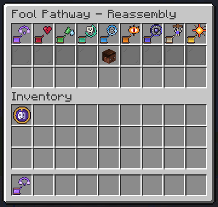

# Grafting

A Paper 1.21 plugin that brings **Reassembly / Grafting**, the Sequence 1 *Attendant of Mysteries* power from the Fool pathway (*Lord of the Mysteries*), into Minecraft.

## How to use it

1. Drop `Grafting-2.2.0.jar` into your Paper server's `plugins/` folder and restart.
2. Run `/graft give` to get the **Thread of Grafting**.
3. Pick an ability, then right-click two things. The **first** is grafted **onto** the second.

| Action | Effect |
|---|---|
| **Left-click** | Switch to the next ability |
| **Sneak + left-click** | Open the pathway menu |
| **Right-click** | Tie the thread to whatever you're looking at, up to 48 blocks away |
| **Sneak + right-click** | Tie the thread to **yourself** |
| **Sneak + F** | Use a grafted creature power, or open your grafted storage |

The thread is plain string; its name and colour show the current ability. A particle thread shows every live graft. A graft snaps if either end is destroyed, and unravels after a while.

Every player also carries the **Fool sigil** in the top-left inventory slot. Hover it for your spirit, distance level and threads, click it to open the **pathway menu**:



* **Top rows:** the thirteen abilities. Click one to switch your thread to it.
* **Middle:** your portrait, the **Spirit Body** toggle, and the four **Distance arts** (locked ones show how far you still need to travel).
* **Bottom row:** your active grafts. Click one to cut it.

## Spirit

Every ability costs **spirit**, once per use or every second it is held. Spirit regenerates over time and is shown above the hotbar:

```
✦ ▮▮▮▮▮▮▮▮▮▮▮▮▮▮▯▯▯▯▯▯ 702/1000   ⟷ Lv2 ▮▮▮▯▯▯▯▯
```

The first bar is spirit, the second is progress to the next distance level.

## Abilities

| Ability | First ➜ Second | What happens |
|---|---|---|
| **Distance** | depends on the art | Four arts, unlocked by distance level (below). |
| **Fate** | Being ➜ Being | Harm meant for the first lands on the second instead. |
| **Nature** | Place ➜ Being | The being takes on the nature of the block (below). |
| **Death & Return** | Being ➜ Place | The being's next death becomes a trip back to the block, alive. One use. |
| **Exchange** | Being ➜ Being | The two swap places, and again every time the first is struck. |
| **Enmity** | Being ➜ Being | Every creature hunting the first now hunts the second. |
| **Gravity** | Being ➜ Place | For the being, "down" points at the block. |
| **Puppetry** | Being ➜ Being | The second moves exactly as the first moves. |
| **Supernova** | Place ➜ Anything | A star's death is grafted onto the target: it collapses, then detonates. The caster is never harmed. |
| **Life** | Being ➜ Being | The first's life lives in the second. Kill the second and the first dies too. Beyonders of the same or higher sequence usually resist. |
| **Location** | Place ➜ Place | The areas around both blocks trade places, chests and contents included, until you cut the thread. Undone automatically after a restart. |
| **Ability** | Being ➜ Being | Yourself ➜ a player: they get a borrowed thread locked to one of your abilities (`/graft lend <ability>`). A creature ➜ a player: they gain its power (blaze fire, ender blink, ghast fireball, creeper blast, evoker fangs, breeze gust on sneak + F, or a passive trait). Costs spirit every second. |
| **Storage** | Place ➜ Being | A chest, barrel or shulker box becomes part of a player's inventory: open it anywhere with sneak + F or `/graft storage`, and items that don't fit flow into it. |

### Spirit Body

Shift into it with `/graft body` or the soul torch in the menu. You can fly and take **no physical damage**, but **magic still hurts**. Using any ability returns you to your main body.

### Distance arts

Your distance level rises with the blocks you travel through your own distance grafts (500, 2000 and 6000 blocks). Each level unlocks an art and extends the earlier ones. Choose one in the menu or with `/graft art`.

| Level | Art | How it works |
|---|---|---|
| 1 | **Step** | Right-click a block, or type `x y z` in chat while holding the Distance thread. Your next step lands there. |
| 2 | **Gateway** | Place ➜ Place. Step on one block, arrive on the other, both ways. |
| 3 | **Enemy Step** | Being ➜ Place. A being near you: its next step lands on the block you chose. |
| 4 | **Infinity** | Right-click to raise or lower. Attacks never reach you, but it drains spirit every second and more for each blocked hit. |

### Natures (for the Nature ability)

| Block | Nature | Effect |
|---|---|---|
| Slime block | Bounce | Falls become bounces, no fall damage |
| TNT | Volatility | Explodes the next time it is struck (no block damage) |
| Ice / snow | Frost | Freezes water underfoot, chills what it hits |
| Magma, netherrack, campfire... | Flame | Fire immune, ignites what it hits |
| Glowstone, lanterns, torches... | Light | Glows, sees in the dark, burns nearby undead |
| Cobweb, honey, soul sand, mud | Stickiness | Can barely move |
| Wool, leaves, hay | Feather | Drifts instead of falling |
| Prismarine, sponge, kelp... | Water | Breathes and swims like a fish |
| Flowers, saplings, crops... | Life | Slowly heals |
| Any other solid block | Stone | Takes far less damage, moves like a statue |

## Commands

| Command | |
|---|---|
| `/graft give [player]` | Get the Thread of Grafting (op) |
| `/graft menu` | Open the pathway menu |
| `/graft mode <ability>` | Switch ability by name |
| `/graft list` | Your active grafts |
| `/graft sever [id\|all]` | Cut a graft |
| `/graft body` | Enter or leave your Spirit Body |
| `/graft art <step\|gateway\|enemy\|infinity>` | Choose your Distance art |
| `/graft step <x> <y> <z> [world]` | Your next step lands there |
| `/graft lend <ability>` | What the Ability graft lends |
| `/graft storage` | Open your grafted storage |
| `/graft level [player] [1-4]` | Show, or (op) set, the distance level |
| `/graft spirit [player] [amount\|refill]` | Show, or (op) set, spirit |
| `/graft sequence <player> [0-9\|none]` | Show, or (op) set, a player's sequence for resistance |

Permissions: `grafting.use` (everyone), `grafting.take` (everyone), `grafting.give` and `grafting.admin` (op). Costs, durations and ranges are all in `config.yml`.

## Project structure

```
src/main/java/io/github/auphantom/grafting/
  GraftingPlugin.java     plugin entry point, wires everything together
  anchor/                 the two ends of a thread: BlockAnchor (a place), EntityAnchor (a being)
  beyonder/               spirit, distance levels, Spirit Body, Step, Infinity, the HUD
  command/                /graft
  graft/                  Mode (the abilities), Graft (base class), GraftFactory, GraftManager
  graft/types/            one class per graft: Fate, Nature, Life, Location, Storage...
  item/                   ThreadItem and the Fool Sigil
  listener/               clicks, damage and the sigil slot
  pack/                   serves the bundled resource pack to players
  ui/                     the pathway menu and tooltip bars
  util/                   particles and text helpers
src/main/resources/       plugin.yml and config.yml
tools/packgen/            build-time generator for the resource pack (sigil and tooltips)
tests/e2e/                end-to-end test: a bot client plays every ability on a live server
docs/images/              README image
```

Build with `./gradlew build` (JDK 21). The jar lands in `build/libs/`.
