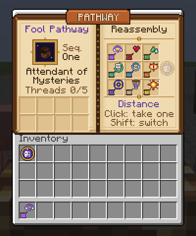
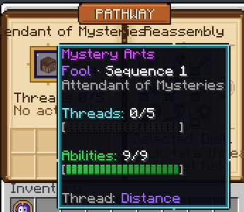
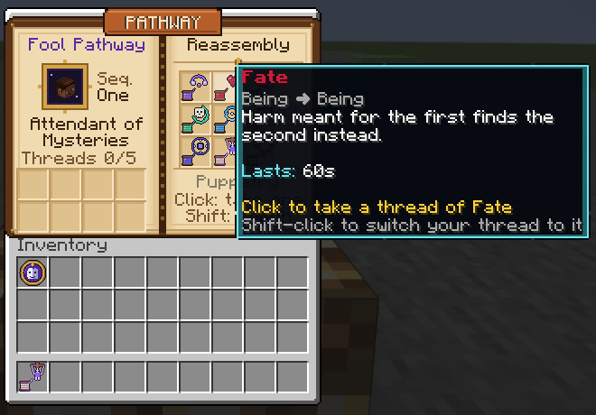
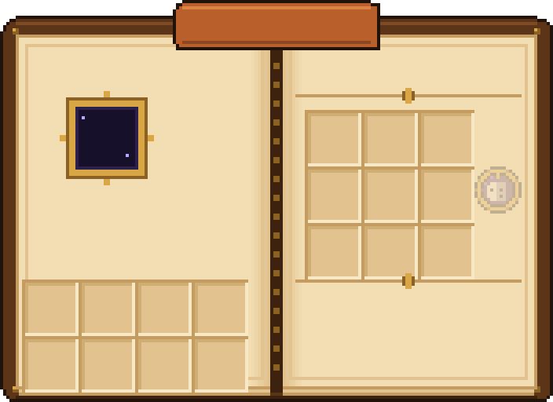

# Grafting

A standalone Paper plugin that turns **Reassembly / Grafting**, the Sequence 1 *Attendant of Mysteries* power from the Fool pathway (*Lord of the Mysteries*), into something you can actually use in Minecraft.

> *"Everything can be connected, if you know where to make the cut."*

In the novel, Grafting takes two things (objects, concepts, rules, even directions) that should never touch and stitches them together, so one starts behaving according to the other. This plugin keeps that core idea and nothing else: no spirituality, no Beyonder sequences, no databases. There's one item, nine abilities, and one rule.


## The idea: one thread, two ends

You hold the **Thread of Grafting**. Pick an ability, then right-click two things. The **first** is grafted **onto** the second. Order matters, just like in the books: grafting A onto B is not the same as grafting B onto A.

| Ability | First ➜ Second | Concept tampered with | What happens |
|---|---|---|---|
| **Distance** | Place ➜ Place | distance | The distance between two blocks becomes zero. Step on one and you're already standing on the other. Works both ways, for players, mobs and dropped items. |
| **Fate** | Being ➜ Being | harm | Harm meant for the first being finds the second one instead, wherever it is. |
| **Nature** | Place ➜ Being | properties | The being takes on the *nature* of the block (see below). |
| **Death & Return** | Being ➜ Place | death | The being's next death is grafted onto a journey home. The killing blow never lands, and it's pulled back to the block alive. One use. |
| **Exchange** | Being ➜ Being | position | The two swap places, and swap again every time the first is struck, so the attacker suddenly faces the second. |
| **Enmity** | Being ➜ Being | hostility | Every creature hunting the first now hunts the second. Graft yourself onto a pig and the horde turns on the pig. |
| **Gravity** | Being ➜ Place | "down" | For the being, down now points at the block. It falls sideways, upward, across chasms, and never takes fall damage. |
| **Puppetry** | Being ➜ Being | movement | The second moves exactly as the first moves, on marionette strings. A nod to the Fool pathway. |
| **Supernova** | Place ➜ Anything | a star's death | The *death of a star* (any block) is grafted onto the target. A sun kindles around it and drags in everything nearby, collapses to a point, then detonates in a blinding flash and an expanding shockwave. The caster is never harmed. Once ignited it can't be stopped. |

### Natures (Place ➜ Being)

| Block | Nature | Effect on the being |
|---|---|---|
| Slime block | **Bounce** | Falls turn into (damped) bounces, so no fall damage |
| TNT | **Volatility** | Explodes the next time something strikes it (no block damage, one use) |
| Ice / snow | **Frost** | Freezes water underfoot, chills whatever it hits, immune to freezing |
| Magma, netherrack, campfire, furnace... | **Flame** | Fire immune, ignites whatever it strikes and whoever strikes it |
| Glowstone, lanterns, torches, froglights... | **Light** | Glows, sees in the dark, sets nearby undead on fire |
| Cobweb, honey, soul sand, mud | **Stickiness** | Can barely move |
| Wool, leaves, hay, scaffolding | **Feather** | Drifts instead of falling, runs light-footed |
| Prismarine, sponge, kelp... | **Water** | Breathes and swims like a fish |
| Flowers, saplings, crops, moss... | **Life** | Slowly regrows its wounds |
| Any other full solid block | **Stone** | Takes far less damage, but moves like a statue |

### Rules of the thread

* A graft is **visible**: a two-strand particle thread twists between its two ends in the ability's colour, with bright motes flowing from the first end to the second.
* A graft **snaps** as soon as either end stops existing. Break the block or kill the being and the connection is gone, so the counterplay is to find the anchor block and break it. (Supernova is the exception, because a dying star can't be saved.)
* Grafts **unravel** after a configurable time. One-shot grafts (Death & Return, Volatility, Supernova) end as soon as they're used.
* Each player keeps at most `max-active-grafts` alive. Making a new one lets go of the oldest.

## Controls

| Action | Effect |
|---|---|
| **Left-click** | Switch to the next ability |
| **Sneak + left-click** | Open the pathway book |
| **Right-click** | Tie the thread to whatever you're looking at, up to 48 blocks away (block or being) |
| **Sneak + right-click** | Tie the thread to **yourself** |

| Command | |
|---|---|
| `/graft book` | Open the pathway book |
| `/graft give [player]` | Get the Thread of Grafting (op only by default) |
| `/graft mode <ability>` | Switch ability by name |
| `/graft list` | Your active grafts and their time left |
| `/graft sever [id\|all]` | Cut a graft |
| `/graft pack` | Re-send the texture pack |

Permissions: `grafting.use` (default: everyone), `grafting.take` (draw a thread from the book, default: everyone) and `grafting.give` (default: op).

## The pathway book



Every player carries the **Fool sigil**, the pathway's emblem, in a fixed inventory slot (top-left by default). It can't be dropped, moved or lost on death. Hovering it shows a live *Mystery Arts* readout: your sequence, threads in use, and the selected ability, with segmented bars.

<p>
  
  
</p>

Click the sigil (or right-click while holding it, sneak + left-click with the thread, or `/graft book`) to open the book:

* **Left page:** your portrait, sequence and title, a threads counter, and your **active grafts**. Hover one to see both ends and its time left, click it to sever it.
* **Right page:** the nine abilities. Click one to draw a thread already set to it, shift-click to switch the thread you're holding.

The book is an ordinary chest menu. Its painted pages are a single glyph from a custom font drawn in the window title, positioned with negative-space glyphs, so it needs no client mod. Text is placed on exact pixel rows with a set of shifted fonts, and the whole page is redrawn every second so timers stay live.

## Textures

Every ability has its own icon (shown at the top), and the thread in your hand changes to match the selected ability. The icons, the book pages, the sigil, the tooltip frame and the fonts are all drawn by code (the `packgen` source set in `tools/packgen/`) at build time and packed into a resource pack inside the plugin jar. The generator itself is not shipped in the jar.



The plugin hosts that pack itself on a small built-in web server (JDK `HttpServer`, port 8164) and offers it to every player who joins, so there's nothing extra to set up. If your players reach the server through a public address, set `resource-pack.public-host`, or upload `grafting-pack.zip` anywhere and set `resource-pack.url`. Without the pack, the thread simply looks like string.

## Configuration

```yaml
max-active-grafts: 5
tie-range: 48            # how far right-click can reach
durations:               # seconds
  distance: 120
  fate: 60
  nature: 90
  return: 300
  exchange: 60
  enmity: 60
  gravity: 20
  puppet: 30
max-distance: 256        # Distance grafts refuse to span further, -1 = unlimited
supernova:
  radius: 10
  max-damage: 30         # at the centre, falling off to 0 at the edge
  break-blocks: false
particles:
  density: 1.0           # multiplier for every effect, 0.1 - 4.0
pathway-book:
  sigil: true            # give every player the sigil and keep it in their inventory
  sigil-slot: 9          # 0-8 hotbar, 9-35 storage
resource-pack:
  enabled: true
  custom-models: true
  required: false
  port: 8164
  public-host: ""
  url: ""
```

## Building

Requires JDK 21+.

```bash
./gradlew build
# -> build/libs/Grafting-2.1.0.jar, drop it into a Paper 1.21.x server's plugins/ folder
```

Built against `paper-api 1.21.11`. The only dependency is the Paper API itself (`compileOnly`), with no shading and no external libraries. `./gradlew generatePack` rebuilds just the resource pack, and `./gradlew updateDocs` refreshes the preview images in `docs/images`.

## Code tour

```
src/main/java/io/github/auphantom/grafting/
  GraftingPlugin    wires everything together
anchor/
  Anchor            sealed interface: one end of a thread
  BlockAnchor       a place (remembers its material, so replacing the block snaps the thread)
  EntityAnchor      a being
graft/
  Mode              the nine abilities: name, colour, which kind of thing each end must be
  Graft             base class: id, owner, two anchors, expiry, tick/damage/target hooks
  GraftFactory      turns (mode, first end, second end) into a live graft, or says why not
  GraftManager      ticks grafts, expires/snaps them, draws the threads, routes events
graft/types/
  DistanceGraft  FateGraft  NatureGraft (+ Nature)  ReturnGraft
  ExchangeGraft  EnmityGraft  GravityGraft  PuppetGraft  SupernovaGraft
item/
  ThreadItem        the thread: mode stored in its data, model switched per mode
  Sigil             the Fool sigil and its live Mystery Arts tooltip
listener/
  ThreadListener    clicks -> ability switches, anchors, grafts
  SigilListener     keeps the sigil in its slot, opens the book
ui/
  PathwayBook       the book menu: portrait, abilities, active threads
  GuiTitle Glyphs   draws the painted pages and pixel-placed text into the window title
  Bars              segmented progress bars
pack/PackServer     serves the bundled texture pack to players
command/GraftCommand  /graft
util/Fx             particle toolkit (helix, ring, sphere, burst), scaled by particles.density
util/Text           shared text formatting

tools/packgen/      build-time generator: AbilityIcons, PathwayArt, Pixels, PackGenerator
tests/e2e/          end-to-end test against a live server
docs/images/        README images
```

Adding an ability means adding a `Mode`, a `Graft` subclass that overrides `tick` and/or `onDamage`, one line in `GraftFactory`, and one icon in `AbilityIcons`.

Some details that took more care than they look:

* **Left-click vs right-click.** Minecraft clients swing their arm on every right-click, and the server reports that swing as a left-click in the air. A naive "left-click switches ability" would switch the ability every time you tied a thread. Air left-clicks are therefore held for two ticks and dropped if a right-click lands around them.
* **Fate loops.** Graft A onto B and B onto A, and damage would ping-pong forever. A re-entrancy guard makes the redirected hit land exactly once.
* **Damage the plugin deals on your behalf** (Supernova, redirected Fate, Volatility) is marked, so the "left-clicking a being with the thread switches ability" rule can't accidentally cancel your own Supernova.
* **Gravity** keeps its own velocity for the being instead of reading it back, because a player's physics run on their own client. Reading it back would stack the pull every tick into a violent fling.
* **Death & Return** listens at `HIGHEST` priority and checks `getFinalDamage()` against health plus absorption, so it only triggers on a hit that would *actually* kill.
* **Nature** effects are short ambient potion pulses refreshed every second, so nothing lingers if the plugin is unloaded mid-graft, and a real potion the being drank is never stripped.
* The resource pack zip is **reproducible** (fixed timestamps), so its SHA-1 only changes when the icons do and clients don't re-download it every build.
* **Editing an item while a menu is open.** Changing the held thread from inside the book edits the stack in place, which the client never hears about, so the slot is set again explicitly to push the update.

## Testing

`tests/e2e/` contains an end-to-end test where a real Minecraft client ([mineflayer](https://github.com/PrismarineJS/mineflayer)) joins a live Paper 1.21.11 server running the plugin. It switches abilities the way a player would (left-click, the book, the command) and actually right-clicks blocks and mobs, nearby and at range, to make every kind of graft. The server is driven and inspected over RCON. Among other things it checks:

* left-click cycles abilities, with the item's model following along
* every player gets the sigil in its slot, with the Mystery Arts tooltip, and it comes back if removed
* clicking the sigil opens the book (without picking the sigil up), which lists all nine abilities and the portrait, and clicking an ability sets the thread
* the book hands out a thread of the chosen ability, and sneak + left-click with the thread opens it too
* Distance carries players and items both ways, tied to a block 26 blocks away
* Fate redirects exactly the damage taken, and an A⇄B loop doesn't recurse
* Volatility explodes once without breaking blocks, and snaps when its TNT is removed
* a slime-grafted cow falling 15 blocks bounces and takes no damage
* Death & Return survives 100 damage and sends you home
* Exchange swaps on tie and again on being struck
* Enmity makes a zombie hunt a pig instead of the player
* Gravity makes a pig fall upward toward a block
* Puppetry makes a pig mirror the player's movement
* Supernova destroys its target, hits bystanders and spares the caster

```
51/51 passed
```

To run it, start a Paper server with `online-mode=false`, `enable-rcon=true`, `rcon.password=test`, then run `cd tests/e2e && npm install && npm test`.
